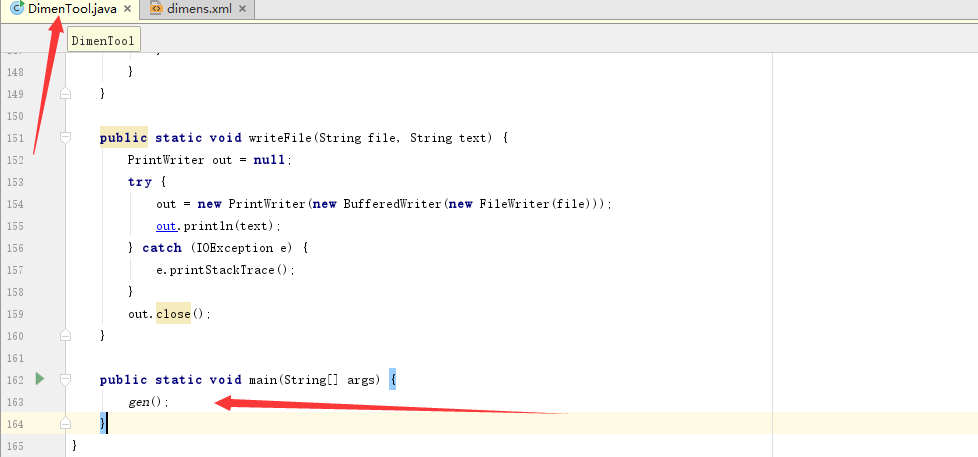
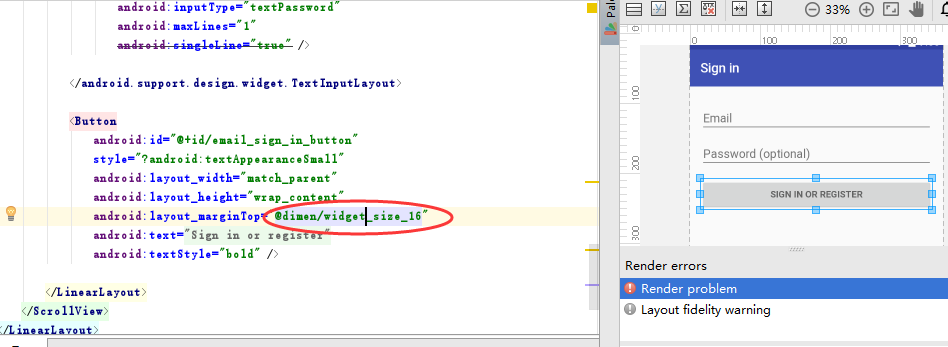

# AndroidUIAdapter
安卓屏幕适配方案，根据设计图画布大小和像素尺寸实时适配，一次配置永久使用，适配所有市面上各种大小不一的安卓手机屏幕

#### 用法

###### 一二步仅为第一次使用时配置即可，后面都直接使用第三步在xml中引用

##### 第一步：在你的项目的DimenTool.java文件中中注明你的设计稿的尺寸，并进行修改成你的设计图的尺寸

##### 第二步：执行Main函数生成相对应的dimens.xml文件

##### 第三步：根据你的设计图标注算出相应的dp，并直接引用
通常标注图上是px为单位，换算成dp公式为 --> px/密度 = dp ,（密度现在市场上一般为2，详情参考下面链接），然后直接在你想要适配的xml中进行引用算出的dp，如设计图上写着32px即为16dp

 

#### 屏幕适配参考链接

[一分钟了解Android屏幕 ldpi mdpi hdpi xhdpi](http://www.2cto.com/kf/201506/404773.html)

[Android屏幕大小适配问题解决](http://www.2cto.com/kf/201405/301671.html)

[Android屏幕适配小技巧sw<n>dp](http://blog.csdn.net/chenzujie/article/details/9874859)
